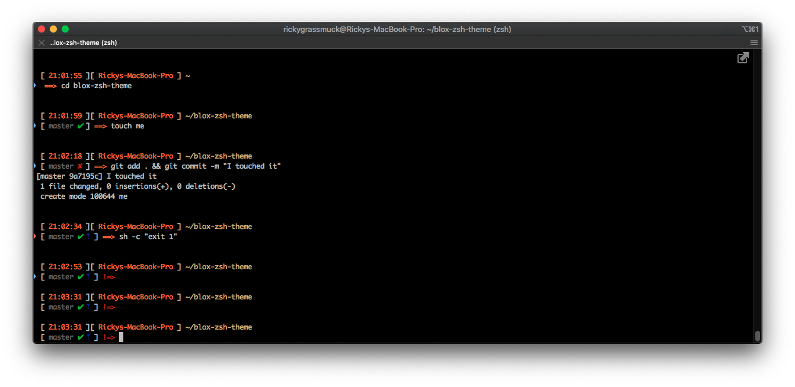
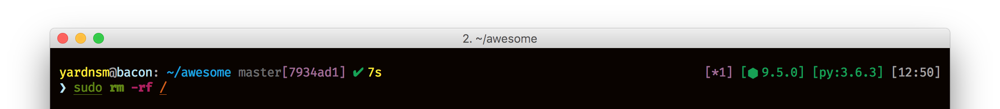

# Blox

> Clean, Boxy ZSH theme based on https://github.com/yardnsm/blox-zsh-theme



Blox is a minimal and fast ZSH theme that shows you what you need. It consists of blocks, and you
can play with the order and change everything; it comes with some pre-defined blocks, but you can
create your own or even modify them.

---

## Install

This theme was tested on all the following methods, but it should be compatible with almost every
zsh framework / plugin manager.

### For antigen users

Simply add the following into your `~/.zshrc`

```console
antigen bundle rigrassm/blox-zsh-theme
```

### For zgen users

```console
zgen load rigrassm/blox-zsh-theme
```

### For antibody users

```console
antibody bundle rigrassm/blox-zsh-theme
```

### For oh-my-zsh users

1. Symlink (or copy) `blox.zsh` to `~/.oh-my-zsh/custom/themes/blox.zsh-theme`.
2. Set `ZSH_THEME="blox"` in your `.zshrc` file.

### Manual installation

1. Get the file `blox.zsh`; Either:

    - Clone this repo
    - ... or add it as a submodule.
    - Just download `blox.zsh`.

2. `source` it in your `~/.zshrc`:

    ```console
    source PATH_FOR_BLOX.zsh
    ```

---

## The prompt



The main idea of this theme is dividing the prompt into Boxes. The boxes are modular and they
could be arranged and modified. Each box has its options, which can also be customized. The plugin provides the necessary helper functions to construct your custom box.

The following sections describe the built-in boxes and their customizing options.

### Core options

| Variable | Default | Meaning |
| :------- | :------ | :------ |
| `BLOX_CONF__BLOCK_PREFIX` | `'['` | A block's prefix. Some blocks may use it. |
| `BLOX_CONF__BLOCK_SUFFIX` | `']'` | A block's suffix. Some blocks may use it. |
| `BLOX_CONF__BLOCK_SEPARATOR` | `' '` | The character used to separate blocks. |
| `BLOX_CONF__PROMPT_PREFIX` | `'\n'` | The prompt's prefix (the default adds a newline between prompts). |
| `BLOX_CONF__ONELINE` | `false` | **When setting to `true`, the lower segments will be disabled** |

### Built-in blocks

#### `cwd`

Displays the current working directory.

| Variable | Default | Meaning |
| :------- | :------ | :------ |
| `BLOX_BLOCK__CWD_COLOR` | `'blue'` | This block's color |
| `BLOX_BLOCK__CWD_TRUNC` | `3` | Number of folders of cwd to show in prompt (0 to show all) |

#### `symbol`

The prompt's symbol.

| Variable | Default | Meaning |
| :------- | :------ | :------ |
| `BLOX_BLOCK__SYMBOL_COLOR` | `'cyan'` | The symbol's color |
| `BLOX_BLOCK__SYMBOL_EXIT_COLOR` | `'red'` | The symbol's color when last command didn't exit with `0` |
| `BLOX_BLOCK__SYMBOL_SYMBOL` | `'❯'` | The symbol |
| `BLOX_BLOCK__SYMBOL_EXIT_SYMBOL` | `'❯'` | The symbol when last command didn't exit with `0` |
| `BLOX_BLOCK__SYMBOL_ALTERNATE` | `'◇'` | Alternate symbol (used as `PROMPT2`) |
| `BLOX_BLOCK__SYMBOL_SEPARATOR` | `BLOX_CONF__BLOCK_SEPARATOR` | Use a different separator then what is used for separating standard Boxes |

#### `git`

Shows git info.

| Variable | Default | Meaning |
| :------- | :------ | :------ |
| `BLOX_BLOCK__GIT_BRANCH_COLOR` | `'242' (grey)` | Branch name color |
| `BLOX_BLOCK__GIT_COMMIT_SHOW` | `true` | Show the commit hash |
| `BLOX_BLOCK__GIT_COMMIT_COLOR` | `'magenta'` | Commit hash color |
| `BLOX_BLOCK__GIT_CLEAN_COLOR` | `'green'` | Clean branch indicator color |
| `BLOX_BLOCK__GIT_CLEAN_SYMBOL` | `'✔︎'` | Clean branch indicator symbol |
| `BLOX_BLOCK__GIT_DIRTY_COLOR` | `'red'` | Dirty branch indicator color |
| `BLOX_BLOCK__GIT_DIRTY_SYMBOL` | `'✘'` | Dirty branch indicator symbol |
| `BLOX_BLOCK__GIT_STASHED_COLOR` | `'cyan'` | Stashed files indicator color |
| `BLOX_BLOCK__GIT_STASHED_SYMBOL` | `'\$'` | Stashed files indicator symbol |
| `BLOX_BLOCK__GIT_UNPULLED_COLOR` | `'red'` | Behind of remote indicator color |
| `BLOX_BLOCK__GIT_UNPULLED_SYMBOL` | `'⇣'` | Behind of remote indicator symbol |
| `BLOX_BLOCK__GIT_UNPUSHED_COLOR` | `'blue'` | Ahead of remote indicator color |
| `BLOX_BLOCK__GIT_UNPUSHED_SYMBOL` | `'⇡'` | Ahead of remote indicator symbol |

#### `host`

Shows host info (user@machine).

| Variable | Default | Meaning |
| :------- | :------ | :------ |
| `BLOX_BLOCK__HOST_USER_SHOW_ALWAYS` | `false` | If false, the username will be shown only if `$LOGNAME` is different from the current logged user. |
| `BLOX_BLOCK__HOST_USER_COLOR` | `'yellow'` | User info color |
| `BLOX_BLOCK__HOST_USER_ROOT_COLOR` | `'red'` | The color to show when the logged user is root. |
| `BLOX_BLOCK__HOST_MACHINE_SHOW_ALWAYS` | `false` | If false, the working machine name is shown only in SSH session. |
| `BLOX_BLOCK__HOST_MACHINE_COLOR` | `'cyan'` | The machine name color |

#### `bgjobs`

Shows indicator if there are background jobs running.

| Variable | Default | Meaning |
| :------- | :------ | :------ |
| `BLOX_BLOCK__BGJOBS_SYMBOL` | `'*'` | The indicator to show |
| `BLOX_BLOCK__BGJOBS_COLOR` | `'magenta'` | The block's color |

#### `time`

Shows the time in `HH:mm` format

| Variable | Default | Meaning |
| :------- | :------ | :------ |
| `BLOX_BLOCK__TIME_COLOR` | `'white'` | The block's color |

#### `nodejs`

Shows nodejs version if there is a `package.json` file in the working directory.

| Variable | Default | Meaning |
| :------- | :------ | :------ |
| `BLOX_BLOCK__NODEJS_SYMBOL` | `'⬢'` | The indicator to show |
| `BLOX_BLOCK__NODEJS_COLOR` | `'green'` | The block's color |

#### `pyenv`

Display the python version being used by pyenv.

| Variable | Default | Meaning |
| :------- | :------ | :------ |
| `BLOX_BLOCK__PYENV_COLOR` | `'green'` | The block's color |

#### `virtualenv`

Display the name of the currently used virtualenv.

| Variable | Default | Meaning |
| :------- | :------ | :------ |
| `BLOX_BLOCK__VIRTUALENV_COLOR` | `'green'` | The block's color |

#### `exec_time`

Display the last command's execute time.

| Variable | Default | Meaning |
| :------- | :------ | :------ |
| `BLOX_BLOCK__EXEC_TIME_MIN_ELAPSED` | `5` | The minimum number of seconds for showing the block |
| `BLOX_BLOCK__EXEC_TIME_PERSIST` | `false` | If enabled, the timestamp wont be cleared up until next execution. Can be useful when needed to re-draw the prompt. |
| `BLOX_BLOCK__EXEC_TIME_COLOR` | `'yellow'` | The block's color |

---

## Further Customizing

### Setting the structure

The prompt consists of 4 segments: upper left, upper right, lower left and lower right. You can set
the value of each segment by simply change it's value. The value of a segment is an array of strings
representing the boxes name.

:warning: **Note:** You can make the prompt oneline instead of multiline by changing the value of
`BLOX_CONF__ONELINE`. **This will disable the lower segments!**

| Variable | Default |
| :------- | :------ |
| `BLOX_SEG__UPPER_LEFT` | `( host cwd git exec_time )` |
| `BLOX_SEG__UPPER_RIGHT` | `( bgjobs nodejs pyenv virtualenv time )` |
| `BLOX_SEG__LOWER_LEFT` | `( symbol )` |
| `BLOX_SEG__LOWER_RIGHT` | `( )` |


### Creating boxes

#### Helper Functions
| Function | Args | Desc |Usage |
| :------- | :------ | :------ | :------ |
| `blox_helper__build_block_color` | Builds a box with the contents set to the `color` param passed to it | `color` `string` | `blox_helper__build_block_color "#d2b877" "This string is gonna be gold and inside a box"` |
| `blox_helper__build_block_nocolor` | Just builds a box without setting the content color | `string` | `blox_helper__build_block_nocolor "This string is gonna be inside a box"` |
| `blox_helper__color_string` | Applies the specified color to given string | `color` `string` | `blox_helper__color_string "#d2b877" "This string is gonna be gold"` |

#### Creating your box
A box is just a simple function that echo's a result into one of `blox_helper__build_block_color` or `blox_helper__build_block_nocolor` depending on if your boxes content will have it's colors set dynamically or just using a pre-configured color option. 

The function name should match the naming convention of `blox_block__<name>`. For example:

```shell
function blox_block__helloworld() {
  echo "$( blox_helper__build_block_color "white" "hello world")
}
```

And add the block to the prompt:

```shell
BLOX_SEG__LOWER_RIGHT+=( helloworld )
```

Now you have a "hello world" block in the lower right segment of your prompt! So useful.


---

## License

MIT © [Ricky Grassmuck](https://github.com/rigrassm/blox-zsh-theme)
